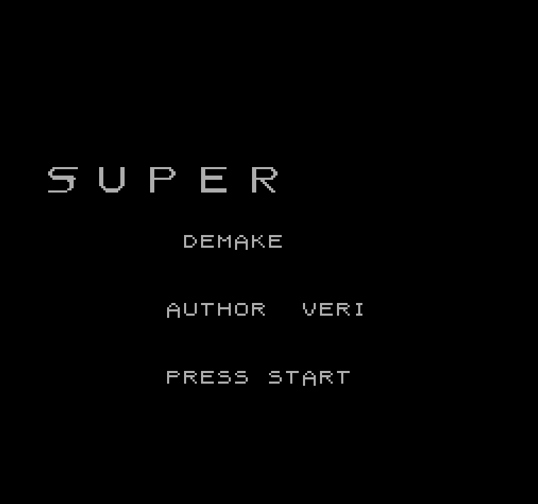

# SUPER HOT NES

A demake of [SUPERHOT](https://superhotgame.com/) for the Nintendo Entertainment System. Time moves when you move.



**[Play in your browser](https://gettierproblem.github.io/superhot-nes/)** | **[Download ROM](https://github.com/gettierproblem/superhot-nes/releases)**


## The Game

You are a white silhouette in a black-and-white world. Red crystalline enemies want you dead. One hit kills everything — you included.

**The twist:** time only advances when you act. Stand still and the world freezes. Bullets hang in the air. Plan your move, then execute.

Four levels. No checkpoints. **SUPER. HOT.**

### Controls

| Button | Action |
|--------|--------|
| D-pad Left/Right | Walk (advances time) |
| D-pad Down | Crouch / Pick up weapon |
| D-pad Down + A | Drop through platform |
| A | Jump (passes through brown platforms) |
| B | Punch / Shoot / Swing katana |
| B (katana) | Always slash (cannot throw) |
| B + direction | Throw held weapon (guns/bottles) |
| B (empty gun) | Auto-throw empty weapon |
| Start | Start game |

Crouch over dropped weapons to pick them up or swap. Weapons: pistol (3 shots), shotgun (2 spread shots), katana (always slash, cannot throw), bottles (throwable). Empty guns can still be thrown as projectiles. Jump kick enemies from above! Brown platforms can be jumped through from below and dropped through with crouch+A.

### Levels

1. **DOJO** — 4 enemies in a house structure. 2 gunners and 2 katana rushers who jump to platforms.
2. **CORRIDOR** — 6 enemies across 2 scrolling screens. Learn the time mechanic the hard way.
3. **ELEVATOR** — 6 enemies across 5 stories with smooth vertical scrolling. Ride the elevator or take the stairs. Brown floors can be jumped through.
4. **BAR** — 7 enemies. Tight spaces, every weapon type, and a locked back room with a katana-wielding boss.

## Building

### Requirements

- [cc65](https://cc65.github.io/) (C compiler for 6502 — `choco install cc65-compiler` on Windows)
- Python 3 (for tile generation)

### Build

```bash
# Generate tile graphics (only needed if you edit tools/gen_chr.py)
python tools/gen_chr.py

# Build the ROM
bash build.sh       # Git Bash / Linux / macOS
build.bat           # Windows CMD
```

Outputs `game.nes` — a 40KB MMC1 ROM (Mapper 1, 32KB PRG + 8KB CHR).

### Run

Open `game.nes` in any NES emulator. [Mesen](https://www.mesen.ca/) recommended for its debugging tools.

## Project Structure

```
src/main.c           Game code (C)
lib/                 NES runtime (neslib + crt0 startup)
cfg/game.cfg         Linker memory map
chr/game.chr         8KB tile graphics (generated)
tools/gen_chr.py     Tile generator (edit this for art changes)
tools/mesen/         Mesen2 emulator
sound/               Reserved for FamiStudio exports
```

## Technical Details

- **Target:** NES / Famicom (MMC1, Mapper 1)
- **ROM:** 32KB PRG-ROM + 8KB CHR-ROM
- **Toolchain:** cc65 + ca65 + ld65 with [neslib](https://github.com/clbr/neslib)
- **Resolution:** 256x240, horizontal and vertical scrolling via switchable mirroring
- **Palette:** Black/white/grey environments, red enemies, brown pass-through platforms. 4 sprite palettes, 4 BG palettes.

## Credits

- Game concept: [SUPERHOT Team](https://superhotgame.com/)
- NES library: [neslib](https://github.com/clbr/neslib) by Shiru
- Built with [cc65](https://cc65.github.io/)

This is a fan project / demake for educational purposes. SUPERHOT is a trademark of SUPERHOT Team.
